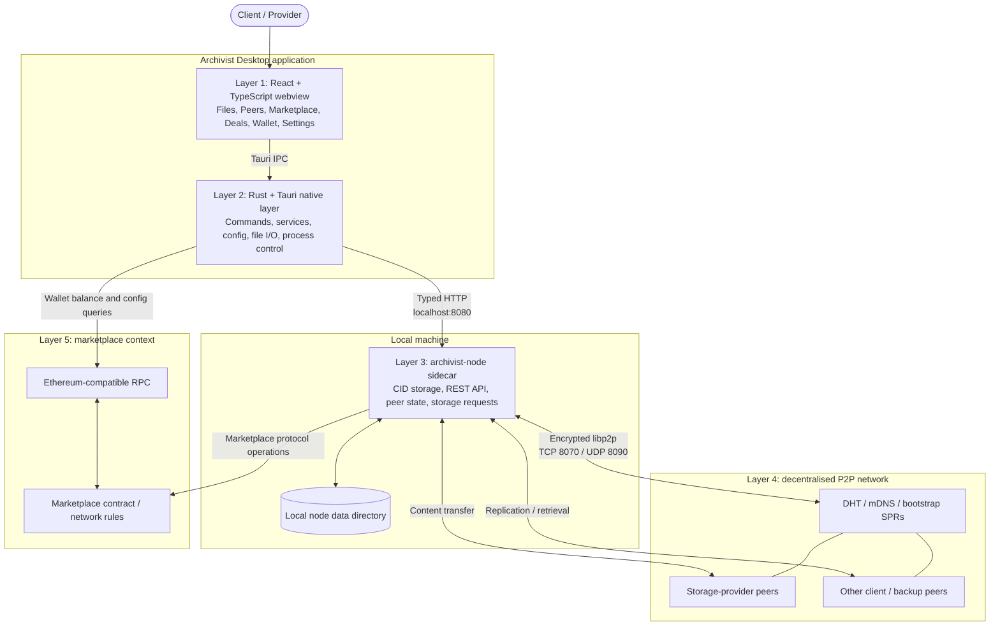
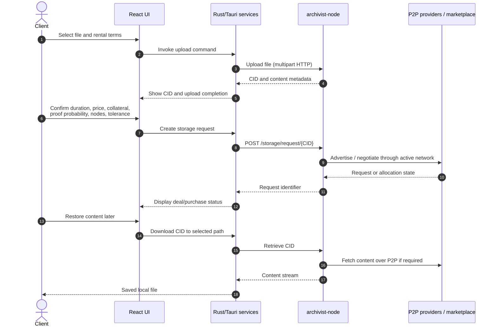
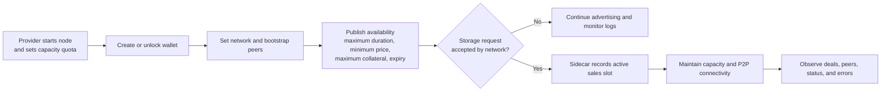
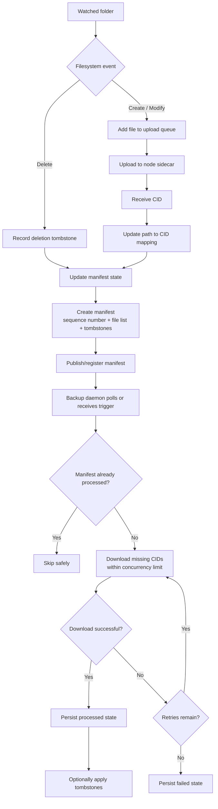
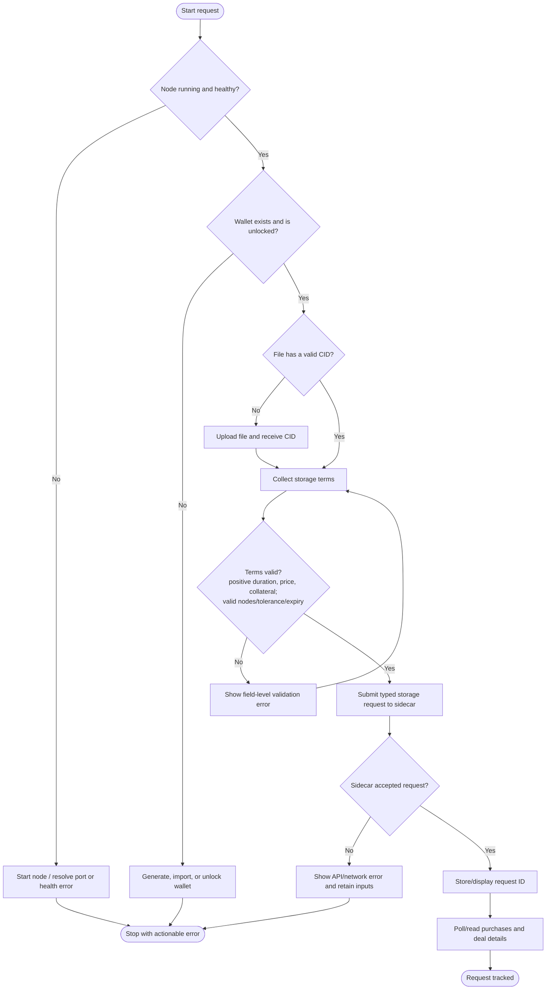

# Decentralized Disk Rental System

## Project documentation and proposed methodology

**Project implementation:** Archivist Desktop  
**Version represented by this repository:** 0.2.5  
**Primary purpose:** Let people store, retrieve, synchronise, and optionally rent disk capacity through a decentralised peer-to-peer storage network.

> **Important scope note.** The desktop application is the user-facing client and native coordination layer. The low-level content-addressed storage, libp2p networking, provider placement, and verifiable erasure-coded copies are performed by the separately shipped `archivist-node` sidecar. This document distinguishes those responsibilities so that it does not overstate what the desktop repository implements by itself.

> **Maturity note.** The repository identifies the software as alpha/pilot software. It must not be the only copy of mission-critical data. Independent backups remain necessary.

---

## 1. Problem statement

Conventional cloud storage concentrates data and control in one provider. A decentralised disk-rental system instead lets:

- a **client** upload a file and request storage for a defined period;
- a **provider** publish terms for supplying spare disk capacity;
- the **peer network** discover peers and transfer content; and
- the **marketplace layer** record purchases and provider slots using an Ethereum-compatible wallet/network configuration.

The central design challenge is to make those capabilities usable on a desktop while preserving content identity, storage controls, peer visibility, and a recoverable local workflow.

### Objectives

1. Provide a desktop workflow for storing and restoring files by content identifier (CID).
2. Enable a storage marketplace in which clients request capacity and providers publish availability and pricing constraints.
3. Keep node lifecycle, filesystem access, configuration, and long-running work outside the browser/webview.
4. Support resilient personal replication through watched folders, manifests, retry processing, and a backup daemon.
5. Make network state and operational failures visible to the user.

### Non-goals and boundaries

- Archivist Desktop does not itself implement the underlying libp2p protocol or CID block store; it talks to `archivist-node` over a localhost REST API.
- The marketplace service in this repository is a typed client/wrapper around sidecar marketplace endpoints. Contract execution and provider-side protocol behaviour depend on the selected sidecar/network.
- The application includes media, web-archiving, torrent, IRC, and encrypted-chat utilities, but they are supporting archival/communication features rather than the core disk-rental transaction path.

---

## 2. System at a glance

### System architecture diagram



## 3. Layer-by-layer architecture

### Layer 1 — Presentation and interaction

The `src/` React application delivers the desktop interface. React Router separates the main user journeys: Dashboard, Connect Peers, Devices, Upload & Download, Make a Deal, My Deals, Wallet, Website Scraper, Torrents, Settings, and developer Logs.

Custom hooks such as `useNode`, `usePeers`, `useSync`, `useWallet`, and `useMarketplace` keep page components focused on presentation while encapsulating asynchronous state and calls into the native layer. Input helpers validate CIDs, normalise storage units, sanitise filenames, and hide sensitive peer/wallet fields for screen-sharing safety.

**Why this layer is selected:** React and TypeScript give a component-based, typed interface that is fast to develop and suitable for data-rich desktop screens. Vite provides a lightweight development/build pipeline.

### Layer 2 — Native orchestration and services

The Rust code in `src-tauri/` is the security and reliability boundary between the webview and the operating system. Tauri commands expose narrowly scoped operations: node control, upload/download, folders and backup, peer management, marketplace, wallet, web archive, torrents, media, IRC, and chat.

Key services include:

| Service | Responsibility |
|---|---|
| `NodeService` | Starts, stops, health-checks, and restarts the sidecar; records status, logs, PID, ports, and failures. |
| `NodeApiClient` | Typed HTTP client for the node REST API, including upload/download and storage marketplace resources. |
| `FilesService` | Coordinates file upload, listing, download, deletion, metadata, and transfer progress. |
| `SyncService` | Watches folders, queues changes, maps paths to CIDs, and creates manifests. |
| `BackupDaemon` | Polls or receives manifest triggers, downloads missing content, retries failures, and applies tombstones. |
| `WalletService` | Generates/imports/unlocks Ethereum keys, encrypts a local keystore, and queries balances. |
| `MarketplaceService` | Publishes provider availability and creates/reads storage requests and purchases. |
| `ConfigService` | Persists application, node, sync, and network settings in TOML. |

**Why this layer is selected:** Rust offers memory safety and strong concurrency for process control, filesystem events, network calls, and background jobs. Tauri has a compact desktop footprint and a deliberate IPC boundary rather than giving a renderer unrestricted native access.

### Layer 3 — Local storage node sidecar

`archivist-node` is a separately managed process. The desktop backend starts it with the configured data directory, capacity limit, API port, P2P ports, bootstrap records, and—when unlocked—marketplace settings. Its local HTTP API is normally `localhost:8080`.

The client uses the node for the operations that require decentralised storage semantics:

- upload local content and obtain a CID;
- list locally known content and storage usage;
- fetch content by CID to a chosen destination;
- inspect peer identity, addresses, and signed peer record (SPR);
- connect to peers and interact with marketplace storage endpoints; and
- manage provider availability, storage requests, sales slots, and purchases.

**Why a sidecar is selected:** It isolates the independently evolving P2P/storage engine from the desktop UI, permits an API-first implementation, and makes the storage node usable by other clients without duplicating the protocol inside the UI application.

### Layer 4 — Peer-to-peer storage network

The sidecar uses libp2p networking. Default ports are TCP **8070** for P2P connections/transfers and UDP **8090** for DHT/mDNS discovery. A user can use UPnP/NAT traversal or configure a manual announce IP. Signed peer records communicate how a peer can be reached.

The exact network topology is decentralised: clients and providers can connect directly, discover peers through configured bootstrap records/DHT/mDNS, and exchange content through encrypted P2P links. Therefore the desktop UI does not require a central file server for normal data transfer.

### Layer 5 — Marketplace and wallet integration

The marketplace makes disk rental explicit. A provider declares availability constraints; a client selects an already-uploaded CID and submits a storage request. The node returns request/purchase identifiers and the desktop reads the corresponding deal status.

The wallet supports devnet and testnet configuration. It generates or imports a secp256k1 private key, derives an Ethereum address, stores the private key in an encrypted local keystore, and queries ETH/token balances through JSON-RPC. It may pass an unlocked key to the node only at runtime to activate marketplace functionality.

---

## 4. Core data model

| Entity | Important fields | Meaning |
|---|---|---|
| Content item | CID, filename, MIME type, dataset size | A content-addressed uploaded object. The CID is the stable reference used for retrieval and rental requests. |
| Storage ask | slots, slot size, duration, proof probability, price/byte/second, collateral/byte, maximum slot loss | The economic and durability terms requested for storage. |
| Storage request | client, ask, content CID, Merkle root, expiry, nonce | A client’s request for storage of a particular content object. |
| Sales slot | storage request, slot index | A provider-side active allocation associated with a request. |
| Availability | maximum duration, minimum price/byte/second, maximum collateral/byte, available-until | A provider’s advertised service constraints. |
| Purchase | purchase identifier and sidecar-provided state/details | A client-visible record of a storage transaction. |
| Folder manifest | folder ID, source peer, sequence number, files, deleted files, statistics | The synchronisation source of truth for continuous backup. |

Numeric values from the sidecar are carefully accepted as either strings or integers because network API versions may serialise large quantities differently. Monetary and capacity values should be treated as exact strings/integers until displayed, avoiding floating-point precision loss.

---

## 5. End-to-end workflows

### A. Client rents decentralised storage

1. **Onboard and start the node.** The user completes the first-run setup, chooses data/network settings, and starts the sidecar. The native service checks process state, ports, required libraries, and API health.
2. **Create or unlock a wallet.** The user generates/imports an Ethereum-compatible key and supplies a password to encrypt/decrypt the local keystore. The application checks that the node reports marketplace capability.
3. **Upload the file.** The user chooses a file. The native layer sends a multipart upload to the sidecar. The node stores/content-addresses it and returns a CID.
4. **Define storage terms.** In Make a Deal, the user chooses duration, proof probability, unit price, collateral, required nodes, tolerated loss, and expiry. Input is represented by `StorageRequestParams`.
5. **Create the request.** The desktop sends `POST /api/archivist/v1/storage/request/{cid}` to the sidecar. The sidecar handles the network/protocol interaction and returns a request ID.
6. **Track the deal.** My Deals obtains purchase IDs and details from the node. The UI shows the information supplied by the active network.
7. **Restore when needed.** The user provides/selects the CID and destination. The node retrieves content through the P2P network and the native layer writes it safely to disk with progress/error reporting.

```text
Local file → upload → CID → choose terms → storage request
    ↑                                              │
    └──────── restore by CID ← deal/purchase ← provider allocation
```

#### Client rental sequence



### B. Provider offers local disk capacity

1. Start a node with a configured data directory and storage quota.
2. Create/unlock a wallet and configure the desired network.
3. Publish availability: maximum duration, minimum acceptable price per byte per second, maximum collateral per byte, and optional availability expiry.
4. The sidecar exposes/uses the offer through the marketplace protocol and records sales slots for accepted requests.
5. Use the dashboard, node logs, and deals views to observe capacity, peers, active slots, and failures.



### C. Continuous replicated backup

1. The user adds a folder to the sync service.
2. The `notify` watcher emits create, modify, and delete events.
3. New or changed files enter an upload queue, are uploaded to the sidecar, and receive CIDs.
4. The service updates its path-to-CID mapping and emits a JSON manifest with a monotonically increasing sequence number.
5. The manifest is registered/published for a backup peer. It includes files, sizes, MIME types, timestamps, and deletion tombstones.
6. A backup daemon polls source peers (or receives a trigger), downloads the newest manifest, skips work it has already processed, retrieves missing CIDs in bounded parallelism, and optionally applies tombstones.
7. Persistent daemon state records completed, in-progress, and failed manifests. Retries are bounded by configuration.

This workflow is a replication/backup mechanism. It complements, but does not replace, marketplace storage contracts.

#### Sync and backup flow



---

## 6. Algorithms, protocols, and selection rationale

| Mechanism | Where used | Purpose | Why it fits |
|---|---|---|---|
| Content addressing / CID | Node sidecar, files, manifests | Identify data by content rather than mutable server path. | Enables integrity-oriented references and retrieval across peers. |
| libp2p with DHT/mDNS discovery | Node sidecar | Peer discovery and P2P transfers. | Removes reliance on one central file host while supporting LAN and wider-network discovery. |
| Verifiable erasure-coded copies | Storage-request path in sidecar | Create durable/verifiable copies for storage requests. | Supports storage-marketplace durability without treating a simple local duplicate as a rental allocation. The precise coding parameters are owned by the sidecar. |
| Merkle root field | Storage request content | Bind/request-verification metadata to content. | Merkle structures are efficient for proving membership/integrity of large datasets. The root is surfaced by the sidecar API. |
| Filesystem event watching (`notify`) | Folder sync | Detect create/modify/remove changes. | Event-driven watching is more responsive and less wasteful than repeated full-directory scans. |
| Manifest + sequence number + tombstones | Sync/backup | Produce an ordered, replay-safe representation of a folder and deletions. | Allows incremental replication, idempotence, and controlled deletion propagation. |
| Bounded retries and bounded concurrent downloads | Backup daemon | Recover from temporary peer/network failure without overwhelming the machine. | Provides predictable resource use and resilient background operation. |
| secp256k1 + Keccak-256 | Wallet | Generate Ethereum-compatible keys and derive addresses. | Matches Ethereum ecosystem identity and marketplace/RPC expectations. |
| Iterated SHA-256 password-and-salt derivation (100,000 iterations) + AES-256-GCM | Wallet keystore | Derive an encryption key from the user password and encrypt private-key material with authenticity protection. | Combines password hardening, confidentiality, and tamper detection for local key storage. |
| Curve25519/Ed25519 pre-key sessions and Olm double ratchet | P2P chat, not disk rental | Establish encrypted direct-message sessions with forward secrecy. | A well-suited asynchronous-messaging design; documented here to separate it from storage-network transport security. |
| TLS + trust on first use (TOFU) | P2P chat/IRC paths | Secure chat transports and detect unexpected identity changes. | Avoids a central certificate authority dependency for peer chat while keeping an explicit verification path. |

There is **no machine-learning model** in the disk-rental design. The system is protocol- and rules-driven: matching/allocation and proof semantics belong to the storage sidecar/network, while the desktop client collects terms, validates inputs, and displays returned state.

### Storage-request decision algorithm

The following diagram is the application-level decision flow. It does not claim to reproduce the sidecar's internal provider-matching or proof algorithm; that logic is outside this repository.



### Pseudocode: manifest-based backup processing

```text
for each configured source peer:
    manifest = discover_latest_manifest(source peer)
    if manifest is absent or manifest.sequence <= stored_sequence(source peer):
        continue

    mark manifest as in-progress
    for each file in manifest.files, up to max_concurrent_downloads at a time:
        if local content for file.cid is already available:
            skip
        else:
            download file.cid with at most max_retries attempts
            record success or failure

    if all required work completed:
        if auto_delete_tombstones:
            process deleted_files safely
        persist processed manifest sequence and statistics
    else:
        persist failure information for retry/diagnosis
```

---

## 7. Implementation approach

### 7.1 API-driven separation

The desktop backend holds a typed `NodeApiClient` instead of embedding the storage protocol. It serialises/deserialises request and response models, handles upload/download streaming, creates marketplace requests, and converts transport errors into user-facing errors. This keeps protocol changes localised to the API boundary.

### 7.2 Native command boundary

React code invokes Tauri commands instead of directly opening arbitrary sockets or files. Commands route requests into Rust services, where path checks, native dialogs, process management, configuration, and error handling are available. The architecture therefore follows this responsibility chain:

```text
Page/component → React hook → Tauri command → Rust service → Node API/P2P sidecar
```

### 7.3 State and observability

`NodeStatus` exposes state transitions—stopped, starting, running, stopping, and error—plus PID, uptime, peers, capacity, peer ID, addresses, restart count, and last error. Health checks and optional auto-restart make the separate sidecar manageable from a normal desktop workflow. Logs are available in the app, and configuration is persisted under the platform application configuration directory.

### 7.4 Safe local persistence

- App settings use TOML in the platform-specific configuration directory.
- Wallet keystores are encrypted and private keys are cached in memory only while unlocked; temporary raw key bytes are zeroised after generation.
- Chat state has its own encrypted key storage/session persistence.
- Backup-daemon processing state is persisted so interrupted jobs can be recognised after restart.

---

## 8. Security, privacy, and reliability considerations

### Security controls implemented

- Sensitive values such as peer IDs, peer records, addresses, and API URLs can be visually masked in the UI.
- Wallet keys are password-encrypted at rest using authenticated encryption.
- Peer and chat identity mechanisms include pre-keys, ratcheting sessions, TLS, safety numbers, and TOFU checks.
- The desktop backend owns sidecar process lifecycle and local filesystem work instead of leaving it to browser JavaScript.
- Configuration supports capacity quotas, controlled ports, manual announce IP, and network selection.

### Operational requirements

| Port | Protocol | Use |
|---|---|---|
| 8080 | Local HTTP | Sidecar REST API (default) |
| 8070 | TCP | P2P connections and transfers |
| 8090 | UDP | DHT/mDNS peer discovery |
| 8085 | TCP | Source manifest server for backup workflows |
| 8086 | TCP | Backup trigger endpoint |

Firewalls and NAT configuration must permit the selected P2P/backup flow. A node may start but remain unreachable to external peers if these conditions are not met.

### Risks and limitations

- Alpha software can lose data; the user must retain separate backups.
- A CID identifies content but does not by itself guarantee an available provider or completed marketplace allocation.
- Wallet password security and endpoint/network selection remain user responsibilities.
- Marketplace economics, proof checking, erasure-code parameters, and on-chain settlement are dependent on the sidecar and active network configuration; they should be verified against the deployed network documentation before production use.
- Deletion tombstones are powerful: backup users should understand whether `auto_delete_tombstones` is enabled.

---

## 9. Testing and verification strategy

The repository includes unit/component tests (Vitest) and end-to-end test suites for onboarding, dashboard, files, settings, devices, peers, marketplace, wallet, media, torrent, node lifecycle, backup server, P2P sync, chat, and IRC. At the time of this documentation, the source tree contains 48 test specification files across `src/test` and `e2e/tests`.

Recommended acceptance checks for the disk-rental path are:

1. Start two nodes on a test network with non-conflicting ports.
2. Upload a known test file and verify its returned CID is shown and can be used for download.
3. Configure a provider availability offer and confirm it appears via the active node/network.
4. Create a storage request with explicit duration, price, collateral, proof probability, node count, and tolerance.
5. Confirm purchase/deal state is displayed and the provider sees the related sales slot where supported by the network.
6. Stop/restart the desktop app and confirm wallet address/configuration persist without exposing the private key.
7. Restore the content by CID to a new location and compare checksum/bytes with the original.
8. For backup, create/modify/delete test files and verify the manifest sequence, retrieval, retry behaviour, and tombstone policy.

Useful project commands:

```bash
pnpm test
pnpm lint
pnpm build
pnpm test:e2e:pw
```

---

## 10. Deployment and operation

### Prerequisites

- Node.js 20+
- pnpm 10+
- Rust 1.77.2+ stable
- OS-specific Tauri/WebView build dependencies
- A platform-matching `archivist-node` sidecar binary

### Development setup

```bash
pnpm setup
pnpm tauri dev
```

`pnpm setup` installs JavaScript dependencies and downloads the appropriate sidecar. Production builds use `pnpm tauri build`; release automation builds the sidecar from source for the target platform.

### Suggested operating sequence

1. Launch the application and review the alpha disclaimer.
2. Configure storage quota, data directory, ports, network, and auto-start/restart preferences.
3. Start the node and confirm peer ID, addresses, storage capacity, and logs.
4. Add peers or bootstrap configuration as required by the selected network.
5. For rental operations, create/unlock a wallet, fund/use the supported test environment, then publish availability or make a deal.
6. Monitor dashboard, deals, logs, capacity, and backup status; maintain a separate independent backup.

---

## 11. Summary

Archivist Desktop is a layered decentralised-storage client that turns a P2P storage node into a usable disk-rental workflow. React provides the operational interface; Rust/Tauri securely bridges to local capabilities; `archivist-node` owns the content-addressed storage and P2P/marketplace protocol; and the configured Ethereum-compatible environment provides wallet and marketplace context.

The key design choices—CIDs, libp2p discovery, sidecar isolation, typed APIs, manifests with sequence numbers/tombstones, bounded background retries, and encrypted local wallet storage—collectively aim to make decentralised storage practical while retaining transparency about the system’s alpha status and protocol boundaries.
